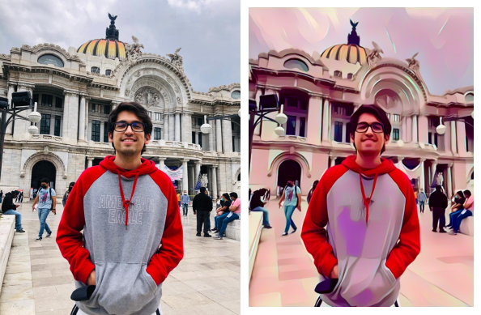

<div id="top"></div>

[![MIT License][license-shield]][license-url]
[![LinkedIn][linkedin-shield]][linkedin-url]


<!-- PROJECT LOGO -->
<br />
<div align="center">
  <a href="https://github.com/othneildrew/Best-README-Template">
    
  </a>

  <h3 align="center">Cartoon generator</h3>

  <p align="center">
    An open source code to cartoonize people
    <br />
</div>


<!-- TABLE OF CONTENTS -->
<details>
  <summary>Table of Contents</summary>
  <ol>
    <li>
      <a href="#about-the-project">About The Project</a>
      <ul>
        <li><a href="#built-with">Built With</a></li>
      </ul>
    </li>
    <li>
      <a href="#getting-started">Getting Started</a>
      <ul>
        <li><a href="#prerequisites">Prerequisites</a></li>
        <li><a href="#installation">Installation</a></li>
      </ul>
    </li>
    <li><a href="#usage">Usage</a></li>
    <li><a href="#roadmap">Roadmap</a></li>
    <li><a href="#contributing">Contributing</a></li>
    <li><a href="#license">License</a></li>
    <li><a href="#contact">Contact</a></li>
    <li><a href="#acknowledgments">Acknowledgments</a></li>
  </ol>
</details>

<!-- ABOUT THE PROJECT -->
## About The Project

This is an open source code that uses VGG architecure to extract the shape of a given image and uses an iterative loop in order to lower the error mergering the style of the Style image to the original image.
<p align="right">(<a href="#top">back to top</a>)</p>

### Built With

Libraries needed:

* [Pillow.py](https://pillow.readthedocs.io/en/stable/)
* [Matplotlib.py](https://matplotlib.org/)
* [Numpy.py](https://numpy.org/)
* [PyTorch.py](https://pytorch.org/)
* [Request.py](https://docs.python-requests.org/en/latest/)
<p align="right">(<a href="#top">back to top</a>)</p>


<!-- GETTING STARTED -->
## Getting Started
### Prerequisites

Install Python
```sh
  Python 3.9.8 or greater
  ```
Install pip
  ```sh
  python get-pip.py
  ```

### Installation
1. Clone the repo
   ```sh
   git clone https://github.com/JorgeHdeM/Cartoon-image.git
   ```
2. Install NPM packages
   ```sh
   pip install requirements
   ```
<p align="right">(<a href="#top">back to top</a>)</p>


<!-- USAGE EXAMPLES -->
## Usage
This code runs in a GPU if its available, it took 5-10 minutes in a GTX 1660Ti
If there are no CUDA cores available, it will run in the CPU but it will take FOREVER.

VGG architecure was used to extract one image shape and merges it with another.

### Use it yourself:
Change line 52 'load_img_name' and change it four your desired picture which needs to be in 'images' folder alongside the style picture which is 'mariana.jpg'.

<p align="right">(<a href="#top">back to top</a>)</p>

<!-- CONTRIBUTING -->
## Contributing
Any contributions you make are **greatly appreciated**.
Don't forget to give the project a star! Thanks again!
<p align="right">(<a href="#top">back to top</a>)</p>

<!-- LICENSE -->
## License
Distributed under the MIT License. See `LICENSE.txt` for more information.
<p align="right">(<a href="#top">back to top</a>)</p>

<!-- CONTACT -->
## Contact
Linkedin - [@JorgeAntonioHernandezMendoza](https://www.linkedin.com/in/jorge-antonio-hern%C3%A1ndez-mendoza-746315169/) - jorgehdezm10@gmail.com
<p align="right">(<a href="#top">back to top</a>)</p>


<!-- ACKNOWLEDGMENTS -->
## Acknowledgments
* [Udacity](https://www.udacity.com/online-learning-for-individuals?utm_source=gsem_brand&utm_medium=ads_r&utm_campaign=12949811881_c_individuals&utm_term=123473112164&utm_keyword=udacity_e&gclid=CjwKCAjwjtOTBhAvEiwASG4bCCBOyCSp16IGqfdaQMth1pMwJYpYdk-1ww6ZMwpchw6g0fx2VIaM4xoCc8wQAvD_BwE)
* [VGG architecture](https://arxiv.org/abs/1409.1556)

<p align="right">(<a href="#top">back to top</a>)</p>


<!-- MARKDOWN LINKS & IMAGES -->
<!-- https://www.markdownguide.org/basic-syntax/#reference-style-links -->
[contributors-shield]: https://img.shields.io/github/contributors/othneildrew/Best-README-Template.svg?style=for-the-badge
[contributors-url]: https://github.com/othneildrew/Best-README-Template/graphs/contributors
[license-shield]: https://img.shields.io/github/license/othneildrew/Best-README-Template.svg?style=for-the-badge
[license-url]: https://github.com/othneildrew/Best-README-Template/blob/master/LICENSE.txt
[linkedin-shield]: https://img.shields.io/badge/-LinkedIn-black.svg?style=for-the-badge&logo=linkedin&colorB=555
[linkedin-url]: https://www.linkedin.com/in/jorge-antonio-hern%C3%A1ndez-mendoza-746315169/